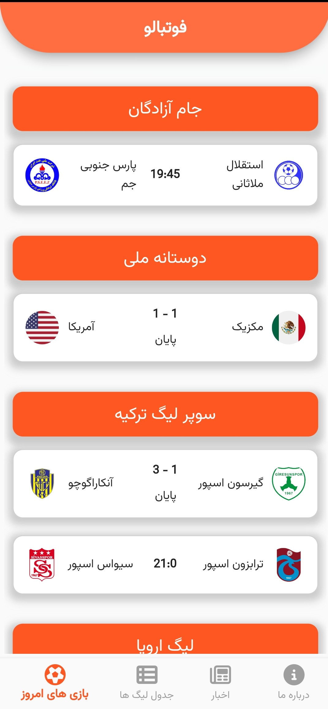
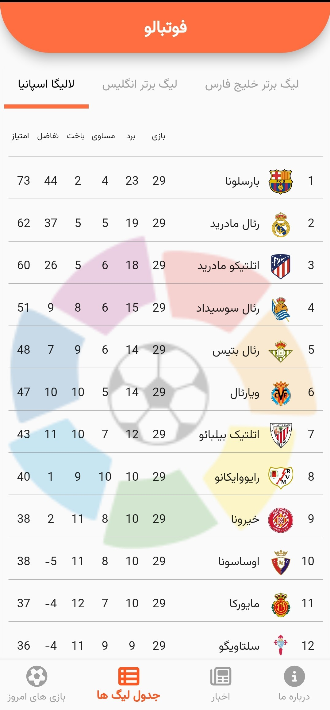
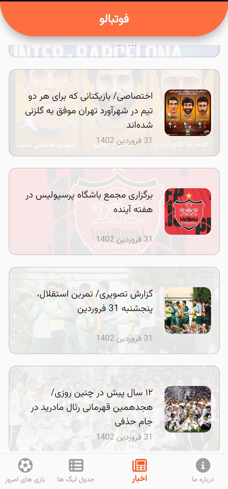
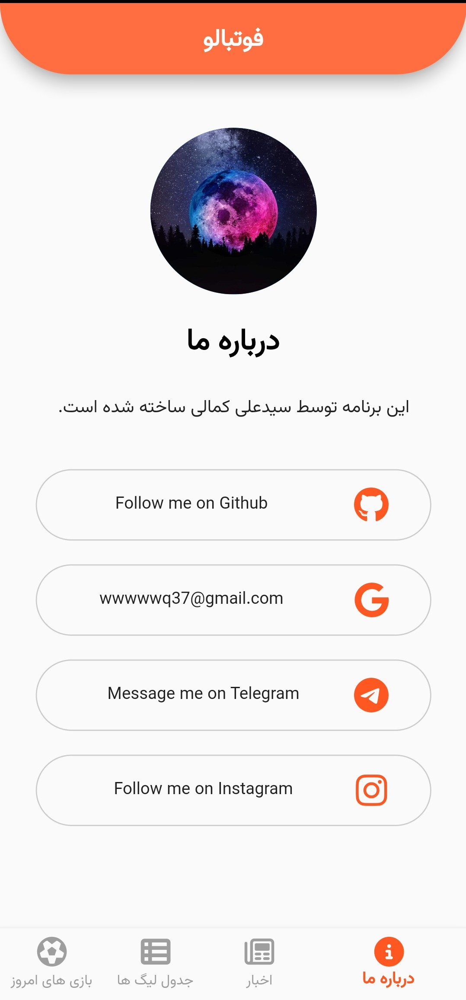

# Footballo App
    
_This is a football app project with the flutter framework._

<br>

# Starting 🚀

_These instructions allow you to get a copy of the running project on your local machine._

## Pre-requisites 📋
_You need flutter sdk: '>=2.19.6 <3.0.0'_

## Installation 🔧

- Make a git clone or download it in zip
```bash
git clone https://github.com/irania9O/football_application.git
```
- Get in the directory

<br>

# Run 🚀:

```bash
flutter run [your device]
```
<br>

# Build 🚀:

```bash
flutter build [your device] 
```
<br>

## Available devices 📋:
```bash
  aar         Build a repository containing an AAR and a POM file.
  apk         Build an Android APK file from your app.
  appbundle   Build an Android App Bundle file from your app.
  bundle      Build the Flutter assets directory from your app.
  linux       Build a Linux desktop application.
  web         Build a web application bundle.
```

# Ideas 💡:

- Add a search bar to search for teams.
- Add a search bar to search for players.
- Add a search bar to search for matches.
- Add a search bar to search for leagues.
- Add a search bar to search for competitions.
- Add news details.
- Add team details.
- Add player details.
- Add match details.

<br>

# Screenshots
<p float="left">
  
   
</p>
<p float="left">
  
   
</p>